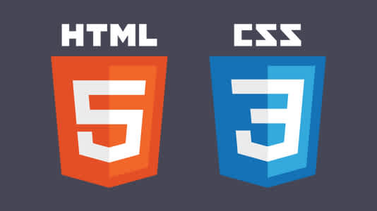

# Web Design

## Subject Code

HTTP-5126-0NA

## Description

This repository features files, folders, and exercises related to the subject of **Web Design**, including content focused on HTML and CSS.

## Tools
- [VS-Code](https://code.visualstudio.com/)
- [Sublime](https://www.sublimetext.com/)
- [Atom](https://atom-editor.cc/)
> 

## Sample Code

```HTML
<!-- The following code displays "Hello World" on the web page -->
 <h1>Hello World!</h1>
```
```CSS
h1{
    /*The following code applies a color property to the H1 element*/
    color: blue;
}
```

## Image

